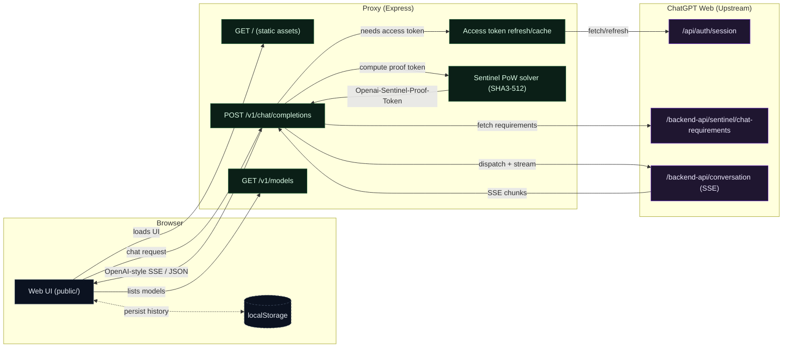

# ChatGPT Proxy & Premium Web Client — Complete Documentation

> Comprehensive documentation of the architecture, implementation, model mapping, and testing performed on the ChatGPT-to-API reverse-engineered proxy and its integrated premium web client.

---

## 📖 Executive Summary

This project transforms the unofficial **ChatGPT-to-API** reverse-engineered proxy server into a **complete, self-contained, premium web application**. It lets users interact with ChatGPT through their browser using existing OpenAI session credentials. The system automatically solves **Sentinel Proof-of-Work (PoW)** challenges (SHA3-512) in the background, ensuring smooth, error-free prompt delivery without `403 Forbidden` blocks.

---

## 🏗️ System Architecture



### Request Flow (Step-by-Step)

1. **Client sends prompt**: The browser client dispatches a `POST /v1/chat/completions` request with the selected model slug, messages array, and streaming preference.
2. **Token Authentication**: The server retrieves a valid `accessToken` — either from a statically configured JWT in `.env`, or by refreshing it using the long-lived `__Secure-next-auth.session-token` cookie.
3. **Sentinel Requirements**: Before sending the actual prompt, the server calls OpenAI's `/backend-api/sentinel/chat-requirements` endpoint to fetch the PoW challenge (seed + difficulty).
4. **Proof-of-Work Solving**: The server iterates through nonces, computing `SHA3-512(seed + base64(config))` until the hash prefix matches the required difficulty. Typical solve times: 0–5ms.
5. **Upstream Dispatch**: The solved proof token is injected into the `Openai-Sentinel-Proof-Token` header, and the full conversation payload is sent to `https://chatgpt.com/backend-api/conversation`.
6. **SSE Stream Processing**: The upstream response is a Server-Sent Events stream. The server decodes each chunk, extracts the text delta, and re-encodes it into OpenAI-compatible `chat.completion.chunk` format before piping it to the client.
7. **Client Rendering**: The browser renders tokens in real-time as they arrive, with live latency tracking.

---

## 🛠️ File-by-File Breakdown

### 1. Backend: `server.js`

| Feature | Implementation |
|:---|:---|
| **Static Assets** | `express.static(path.join(__dirname, "public"))` serves the frontend on `/` |
| **Token Management** | Auto-refreshes JWT from session cookie, caches until expiry |
| **Sentinel PoW** | Fetches challenge from `/backend-api/sentinel/chat-requirements`, solves SHA3-512 |
| **Model Routing** | Reads `model` from request body, passes it directly to upstream `backend-api/conversation` |
| **SSE Re-encoding** | Converts ChatGPT's native SSE format to OpenAI API-compatible `chat.completion.chunk` format |
| **Model List** | `/v1/models` returns a hardcoded compatibility list (not a live probe of upstream availability) |

### 2. Frontend: `public/index.html`

| Feature | Implementation |
|:---|:---|
| **Semantic HTML5** | `<aside>` sidebar, `<main>` chat area, `<header>`, `<footer>` |
| **Model Selector** | `<select>` with `<optgroup>` labels: "Latest • 5.5", "Legacy • 5.x", "Legacy • Other" |
| **Google Fonts** | Outfit (display), Inter (body), Fira Code (code blocks) |
| **Responsive** | Mobile header with hamburger drawer, desktop header with inline selector |

### 3. Styles: `public/style.css`

| Feature | Implementation |
|:---|:---|
| **Dark Theme** | CSS variables: `#08080C` → `#171722` palette with violet-to-pink gradient accents |
| **Glassmorphism** | `backdrop-filter: blur()`, semi-transparent borders, soft glow shadows |
| **Model Selector** | Transparent background, thin borders, custom SVG arrow overlays |
| **Latency Display** | Styled metadata tags with SVG clock icons beneath message bubbles |
| **Responsive** | `@media (max-width: 768px)` breakpoints for mobile sidebar drawer |

### 4. Client Logic: `public/app.js`

| Feature | Implementation |
|:---|:---|
| **Init Guard** | Checks `document.readyState` to avoid `DOMContentLoaded` race conditions |
| **SSE Reader** | `ReadableStream` decoder for real-time token streaming |
| **Live Latency** | `Date.now()` delta calculation, updates every chunk during streaming |
| **localStorage DB** | Stores conversations (id, title, messages, durationMs) persistently |
| **Markdown Parser** | Renders paragraphs, lists, bold, code blocks with copy button |
| **Model Sync** | Desktop/mobile selectors stay synced via shared `currentModel` variable |

---

## 📈 Model IDs, Routing, And What We Can Actually Verify

This proxy exposes an OpenAI-compatible surface, but it ultimately routes to ChatGPT Web (`chatgpt.com/backend-api/conversation`). That upstream API does not behave like the OpenAI API model contract:

1. The `GET /v1/models` list is hardcoded by this proxy for client compatibility.
2. The upstream may silently ignore an unrecognized/unauthorized `model` value and route the request elsewhere.
3. Asking the assistant "what model are you?" is not a reliable verification method.

### Models Advertised By This Proxy

As of the current `server.js`, `GET /v1/models` returns:

`auto`, `gpt-5.5-instant`, `gpt-5.5-thinking`, `gpt-5.5-pro`, `gpt-4o`, `o3`, `o3-pro`, `gpt-4.1`, `gpt-4.5`

### Upstream Model Slug (Best-Effort)

`server.js` now attempts to extract an upstream model slug from the ChatGPT SSE payload (fields vary over time, e.g. `model`, `model_slug`, or `message.metadata.model_slug`). If found, the proxy returns that value in the OpenAI-style response `model` field; otherwise it falls back to the requested model id.

---

## 🧪 Model Routing Verification

### What We Verify

We can verify two things separately:

1. Proxy echo: whether the proxy returns `response.model` matching the requested `model`.
2. Upstream hint: whether the upstream SSE payload contains a model slug we can extract and surface.

### Script: `scripts/verify-models.mjs`

Run against a running proxy:

```bash
BASE_URL=http://localhost:3003/v1 node scripts/verify-models.mjs
```

This script:

1. Reads the model ids from `GET /v1/models`
2. Calls `POST /v1/chat/completions` once per model
3. Prints `requested_model`, `response.model`, and a best-effort `self_report_model` (for debugging only)

### Key Finding

Assistant self-report is not reliable. If you need to know what you actually got, rely on the upstream model slug extraction (when it is present) rather than the assistant's answer.

---

## ⏱️ Response Time Tracking

The latency tracking mechanism calculates round-trip time from request dispatch to response completion.

### Implementation
```javascript
const startTime = Date.now();
// ... API Request Dispatched ...

// During streaming — live timer update:
const elapsedMs = Date.now() - startTime;
metaElement.innerHTML = `⏱ ${(elapsedMs / 1000).toFixed(2)}s`;

// After stream ends — final save:
const finalDuration = Date.now() - startTime;
conversation.messages.push({
  role: 'assistant',
  content: fullContent,
  durationMs: finalDuration
});
```

### What's Measured
- **Total round-trip time** = PoW solve + upstream latency + streaming transfer + SSE decode
- **Live counter** updates in the UI every streaming chunk
- **Persisted** in `localStorage` with each message for historical reference

---

## 🔐 Authentication & Security

### Token Types

| Token | Location | Purpose | Lifetime |
|:---|:---|:---|:---|
| `CHATGPT_ACCESS_TOKEN` | `.env` | Direct JWT for API calls | ~1 hour |
| `CHATGPT_SESSION_TOKEN` | `.env` | Long-lived cookie for refreshing JWT | Days/weeks |
| `CHATGPT_COOKIES` | `.env` | Full cookie string including session token | Variable |

### PoW (Proof-of-Work) Details

OpenAI's Sentinel system requires clients to solve a computational puzzle before each conversation request:

1. **Fetch challenge**: `POST /backend-api/sentinel/chat-requirements` returns `{ seed, difficulty }`
2. **Solve**: Iterate nonces, compute `SHA3-512(seed + base64(config))`, check if hash prefix matches difficulty
3. **Submit**: Include solved token in `Openai-Sentinel-Proof-Token` header

Typical solve time: **0–5ms** (difficulty levels observed: `061a80` to `06de33`).

---

## 🚀 Setup & Startup

### Prerequisites
- Node.js 18+ (for native `fetch` support)
- Valid OpenAI ChatGPT Plus account credentials

### Configuration (`.env`)
```env
PORT=3001
CHATGPT_ACCESS_TOKEN=eyJ...   # JWT from chatgpt.com
CHATGPT_SESSION_TOKEN=eyJ...  # From __Secure-next-auth.session-token cookie
CHATGPT_COOKIES=_puid=...     # Full cookie string (optional, overrides session token)
DEFAULT_MODEL=gpt-5-5         # Default model slug
```

### Run
```bash
npm install
node server.js
# Server starts on http://localhost:3001
```

### Open Client
Navigate to [http://localhost:3001](http://localhost:3001) in your browser.

---

## 📁 Project Structure

```
chatgpt-to-api/
├── .env                 # Credentials & configuration
├── server.js            # Express proxy server (PoW, auth, SSE routing)
├── package.json         # Node.js dependencies
├── DOCUMENTATION.md     # This file
└── public/
    ├── index.html       # Premium chat UI layout
    ├── style.css        # Dark theme, glassmorphism, responsive design
    └── app.js           # Client-side logic (streaming, history, markdown)
```

---

## 📝 Changelog

| Date | Change |
|:---|:---|
| **Session 1** | Initial proxy server with PoW solver, static file serving, premium chat UI |
| **Session 1** | Fixed missing `<script>` tag, SVG pointer events, input event binding |
| **Session 1** | Added model selector dropdowns (desktop + mobile) with `localStorage` sync |
| **Session 1** | Added live response time tracking with persistent `durationMs` metadata |
| **Session 2** | Queried `/backend-api/models` to discover actual backend slugs |
| **Session 2** | Updated model selectors from dotted (`gpt-5.5-instant`) to hyphenated (`gpt-5-5-instant`) slugs |
| **Session 2** | Ran 16-model identity verification test — all respond as "GPT‑5 mini" |
| **Session 2** | Created this comprehensive documentation |
