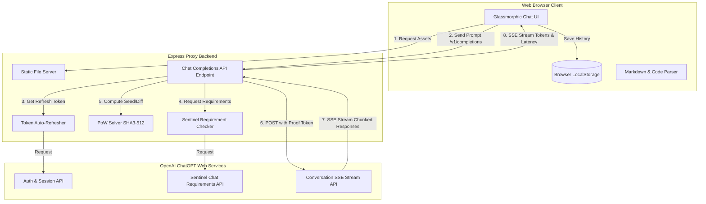

# ChatGPT Proxy & Premium Web Client Integration

Welcome to the comprehensive documentation for the **ChatGPT Proxy & Premium Web Client**. This document details the end-to-end architecture, user interface elements, backend routing logic, and implementation history of the system.

---

## 📖 Executive Summary
The project transforms a reverse-engineered ChatGPT Unofficial API Proxy Server into a complete, self-contained, and premium web application. By integrating a beautiful frontend directly into the server’s static routing system, users can interact with ChatGPT through their browser using their existing session credentials. The system automates the complex **OpenAI Sentinel Proof-of-Work (PoW)** challenge calculations in the background, ensuring smooth, error-free delivery of prompts.

---

## 🏗️ System Architecture



1. **Client-Side Action**: The browser client displays a responsive, animated chat interface. Chat history, metadata, and preferred models are persisted locally via `localStorage`.
2. **Backend Proxy Routing**: The Node.js Express server routes incoming OpenAI-compatible `/v1/chat/completions` API requests.
3. **Automated Token Refresh**: The server fetches short-lived `accessToken`s using a long-lived browser session token (`__Secure-next-auth.session-token`).
4. **Sentinel & Proof-of-Work Solver**: Before routing a prompt to OpenAI, the server fetches Sentinel requirements from OpenAI, extracts difficulty and seed properties, solves the cryptographic `SHA3-512` puzzle, and injects the resulting `Openai-Sentinel-Proof-Token` into the headers of the actual request to avoid `403 Forbidden` errors.
5. **Dynamic Streaming (SSE)**: Response chunks are read, decoded, and piped back to the client in real-time.

---

## 🛠️ File-by-File Breakdown of Changes

### 1. Backend: [server.js](file:///Applications/chatgpt/chatgpt-to-api/server.js)
* **Static Assets Hosting**: Imported the native `path` module and added static middleware so the server hosts the frontend files from `/public` directly on the root path `/`:
  ```javascript
  app.use(express.static(path.join(__dirname, "public")));
  ```
* **Dynamic Model Routing**: Replaced hardcoded model selection with a dynamic mapping parameter, reading the client's choice (`model` field) or falling back to the `.env` default model configuration:
  ```javascript
  const targetModel = model || process.env.DEFAULT_MODEL || "auto";
  ```
* **OpenAI-Compatible Model List Endpoint**: Enhanced the `/v1/models` endpoint to return the complete array of available active and legacy models.

### 2. Frontend Layout: [index.html](file:///Applications/chatgpt/chatgpt-to-api/public/index.html)
* **Semantic Structure**: Built using modern HTML5 tags (`<aside>`, `<main>`, `<header>`, `<footer>`) for structural clarity and SEO best practices.
* **Model Selector Dropdown**: Built structured model selects containing `<optgroup>` labels to cleanly categorize models:
  ```html
  <select id="modelSelect" class="model-select">
    <optgroup label="GPT-5.5 Active">
      <option value="auto">Auto (Smart Routing)</option>
      <option value="gpt-5.5-instant" selected>GPT-5.5 Instant</option>
      <option value="gpt-5.5-thinking">GPT-5.5 Thinking</option>
      <option value="gpt-5.5-pro">GPT-5.5 Pro</option>
    </optgroup>
    <optgroup label="Legacy & Extra Models">
      <option value="gpt-4o">GPT-4o (Legacy)</option>
      <option value="o3">OpenAI o3</option>
      <option value="o3-pro">OpenAI o3 Pro</option>
      ...
    </optgroup>
  </select>
  ```
* **Asset Loading**: Linked google fonts (`Outfit`, `Inter`, `Fira Code`), standard styles, and placed the script tag correctly at the bottom of the body.

### 3. Frontend Styles: [style.css](file:///Applications/chatgpt/chatgpt-to-api/public/style.css)
* **Custom Dark Theme System**: Built with modern CSS variables using a custom dark palette (`#08080C` to `#171722`) with violet-to-pink gradient accents for action buttons.
* **Glassmorphic Dropdowns**: Styled the model selectors with transparent backgrounds, thin borders, backdrop filters, and custom SVG arrow overlays.
* **Real-time Latency Layout**: Styled the response time metadata tags with custom typography and SVG icons beneath message bubbles.
* **Responsive Breakpoints**: Set media queries (`@media (max-width: 768px)`) to auto-grow inputs, collapse the sidebar into a sliding drawer on mobile, and scale typography gracefully.

### 4. Frontend Controller: [app.js](file:///Applications/chatgpt/chatgpt-to-api/public/app.js)
* **Robust Init Pattern**: Solved loading race conditions by checking `document.readyState` instead of relying solely on `DOMContentLoaded`:
  ```javascript
  if (document.readyState === 'loading') {
    document.addEventListener('DOMContentLoaded', init);
  } else {
    init();
  }
  ```
* **Real-time Event-Stream Reader**: Processes incoming SSE chunks and decodes JSON structures to stream assistant text live.
* **Live Latency & Response Tracking**: Added microsecond delta calculations. When streaming, the timer updates **live in the UI** and stops counting when the stream ends.
* **Local Storage Database**: Manages conversations, titles, message lists, and calculated response times, saving them to `localStorage` on every change.
* **Markdown Parser**: Renders lists, bold markers, and embeds custom styled code elements with copy-to-clipboard functionality.

---

## 📈 Model Mapping Guide

Here is how each UI option routes to the actual model behavior:

| UI Selection | Target Model Parameter | Core Behavior / Tier Access |
| :--- | :--- | :--- |
| **Auto** | `auto` | Dynamically routes between Instant and Thinking based on plan. |
| **Instant** | `gpt-5.5-instant` | GPT-5.5 Instant — fast everyday model (All tiers). |
| **Thinking** | `gpt-5.5-thinking` | GPT-5.5 Thinking — deep reasoning (Paid tiers). |
| **Pro** | `gpt-5.5-pro` | GPT-5.5 Pro — research-grade reasoning (Plus/Pro). |
| **GPT-4o** | `gpt-4o` | Legacy multimodal model. |
| **OpenAI o3** | `o3` | Legacy reasoning model. |
| **OpenAI o3 Pro** | `o3-pro` | Legacy reasoning model (Pro Tier). |
| **GPT-4.1 / 4.5**| `gpt-4.1` / `gpt-4.5` | Legacy models. |

---

## ⏱️ Response Time Tracking Detail

The latency tracking mechanism calculates round-trip time from request dispatch to response completion.

### Stream Timing Logic:
```javascript
const startTime = Date.now();
// ... API Request Dispatched ...
while (readingStream) {
  // As chunks arrive, update the UI live:
  const elapsedMs = Date.now() - startTime;
  metaElement.innerHTML = `Response Time: ${(elapsedMs / 1000).toFixed(2)}s`;
}
const finalDuration = Date.now() - startTime;
// Persistent save in history:
active.messages.push({ role: 'assistant', content: fullContent, durationMs: finalDuration });
```

---

## 🚀 Setup & Startup Instructions

1. **Configure Environment**:
   Ensure `/Applications/chatgpt/chatgpt-to-api/.env` has a valid `CHATGPT_SESSION_TOKEN` or `CHATGPT_ACCESS_TOKEN`.
2. **Start Server**:
   ```bash
   npm install
   node server.js
   ```
3. **Open Client**:
   Navigate to [http://localhost:3001](http://localhost:3001) in your browser.
