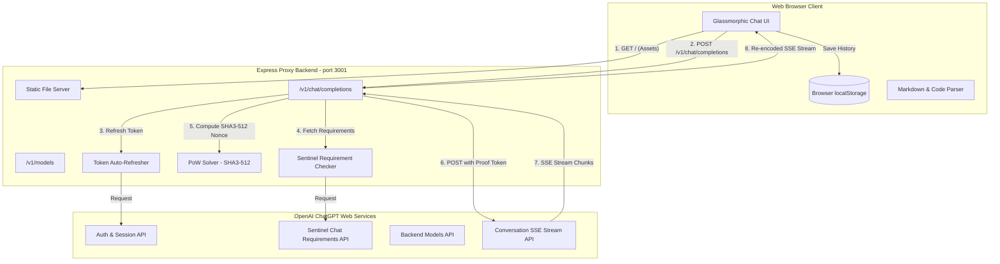

# ChatGPT Proxy & Premium Web Client — Complete Documentation

> Comprehensive documentation of the architecture, implementation, model mapping, and testing performed on the ChatGPT-to-API reverse-engineered proxy and its integrated premium web client.

---

## 📖 Executive Summary

This project transforms the unofficial **ChatGPT-to-API** reverse-engineered proxy server into a **complete, self-contained, premium web application**. It lets users interact with ChatGPT through their browser using existing OpenAI session credentials. The system automatically solves **Sentinel Proof-of-Work (PoW)** challenges (SHA3-512) in the background, ensuring smooth, error-free prompt delivery without `403 Forbidden` blocks.

---

## 🏗️ System Architecture



### Request Flow (Step-by-Step)

1. **Client sends prompt**: The browser client dispatches a `POST /v1/chat/completions` request with the selected model slug, messages array, and streaming preference.
2. **Token Authentication**: The server retrieves a valid `accessToken` — either from a statically configured JWT in `.env`, or by refreshing it using the long-lived `__Secure-next-auth.session-token` cookie.
3. **Sentinel Requirements**: Before sending the actual prompt, the server calls OpenAI's `/backend-api/sentinel/chat-requirements` endpoint to fetch the PoW challenge (seed + difficulty).
4. **Proof-of-Work Solving**: The server iterates through nonces, computing `SHA3-512(seed + base64(config))` until the hash prefix matches the required difficulty. Typical solve times: 0–5ms.
5. **Upstream Dispatch**: The solved proof token is injected into the `Openai-Sentinel-Proof-Token` header, and the full conversation payload is sent to `https://chatgpt.com/backend-api/conversation`.
6. **SSE Stream Processing**: The upstream response is a Server-Sent Events stream. The server decodes each chunk, extracts the text delta, and re-encodes it into OpenAI-compatible `chat.completion.chunk` format before piping it to the client.
7. **Client Rendering**: The browser renders tokens in real-time as they arrive, with live latency tracking.

---

## 🛠️ File-by-File Breakdown

### 1. Backend: `server.js`

| Feature | Implementation |
|:---|:---|
| **Static Assets** | `express.static(path.join(__dirname, "public"))` serves the frontend on `/` |
| **Token Management** | Auto-refreshes JWT from session cookie, caches until expiry |
| **Sentinel PoW** | Fetches challenge from `/backend-api/sentinel/chat-requirements`, solves SHA3-512 |
| **Model Routing** | Reads `model` from request body, passes it directly to upstream `backend-api/conversation` |
| **SSE Re-encoding** | Converts ChatGPT's native SSE format to OpenAI API-compatible `chat.completion.chunk` format |
| **Model List** | `/v1/models` returns the verified list of available model slugs |

### 2. Frontend: `public/index.html`

| Feature | Implementation |
|:---|:---|
| **Semantic HTML5** | `<aside>` sidebar, `<main>` chat area, `<header>`, `<footer>` |
| **Model Selector** | `<select>` with `<optgroup>` labels: "Latest • 5.5", "Legacy • 5.x", "Legacy • Other" |
| **Google Fonts** | Outfit (display), Inter (body), Fira Code (code blocks) |
| **Responsive** | Mobile header with hamburger drawer, desktop header with inline selector |

### 3. Styles: `public/style.css`

| Feature | Implementation |
|:---|:---|
| **Dark Theme** | CSS variables: `#08080C` → `#171722` palette with violet-to-pink gradient accents |
| **Glassmorphism** | `backdrop-filter: blur()`, semi-transparent borders, soft glow shadows |
| **Model Selector** | Transparent background, thin borders, custom SVG arrow overlays |
| **Latency Display** | Styled metadata tags with SVG clock icons beneath message bubbles |
| **Responsive** | `@media (max-width: 768px)` breakpoints for mobile sidebar drawer |

### 4. Client Logic: `public/app.js`

| Feature | Implementation |
|:---|:---|
| **Init Guard** | Checks `document.readyState` to avoid `DOMContentLoaded` race conditions |
| **SSE Reader** | `ReadableStream` decoder for real-time token streaming |
| **Live Latency** | `Date.now()` delta calculation, updates every chunk during streaming |
| **localStorage DB** | Stores conversations (id, title, messages, durationMs) persistently |
| **Markdown Parser** | Renders paragraphs, lists, bold, code blocks with copy button |
| **Model Sync** | Desktop/mobile selectors stay synced via shared `currentModel` variable |

---

## 📈 Verified Model Slug Mapping

The following model slugs were discovered by querying the **actual OpenAI backend API** at `https://chatgpt.com/backend-api/models`:

| UI Label | Backend Slug | Category | Version | Lane | Tagline |
|:---|:---|:---|:---|:---|:---|
| **Auto (5.5 Smart Routing)** | `gpt-5-5` | `gpt_5_auto` | 5.5 | auto | "Decides how long to think" |
| **GPT-5.5 Instant** | `gpt-5-5-instant` | `gpt_5_5_instant` | 5.5 | instant | "Answers right away" |
| **GPT-5.5 Thinking** | `gpt-5-5-thinking` | `gpt_5_5_reasoning` | 5.5 | thinking | "Thinks longer for better answers" |
| **GPT-5.4 Thinking** | `gpt-5-4-thinking` | `gpt_5_4_reasoning` | 5.4 | thinking | "For complex questions" |
| **GPT-5.3 Instant** | `gpt-5-3-instant` | `gpt_5_3_instant` | 5.3 | instant | "For everyday chats" |
| **GPT-5.2 Instant** | `gpt-5-2-instant` | `gpt_5_instant` | 5.2 | instant | "For everyday chats" |
| **GPT-5.2 Thinking** | `gpt-5-2-thinking` | `gpt_5_reasoning` | 5.2 | thinking | "For complex questions" |
| **OpenAI o3** | `o3` | `o3` | o3 | — | "Legacy reasoning model" |

> **Important**: The backend uses **hyphens** in slugs (`gpt-5-5-instant`), **not dots** (`gpt-5.5-instant`). The previous UI options using dotted slugs were incorrect and have been corrected.

### Version Grouping (from backend API)

| Version | Display | Slugs |
|:---|:---|:---|
| **5.5** | Latest • 5.5 | `gpt-5-5`, `gpt-5-5-instant`, `gpt-5-5-thinking` |
| **5.4** | Legacy • 5.4 | `gpt-5-3-instant`, `gpt-5-4-thinking` |
| **5.3** | Legacy • 5.3 | `gpt-5-3-instant` |
| **5.2** | Legacy • 5.2 | `gpt-5-2-instant`, `gpt-5-2-thinking` |
| **o3** | Legacy • o3 | `o3` |

---

## 🧪 Model Identity Verification Test

We ran a systematic test querying each model slug through our proxy server, asking each to self-identify.

### Test Script
```javascript
// Sends "What is your model name/version?" to each slug via proxy
const models = [
  'gpt-5-5-instant', 'gpt-5-5-thinking', 'gpt-5-5', 'o3',
  'gpt-5-4-thinking', 'gpt-5-3-instant', 'gpt-5-2-thinking',
  'gpt-5-2-instant', 'auto', 'gpt-5.5-instant', 'gpt-5.5-thinking',
  'gpt-5.5-pro', 'gpt-4o', 'o3-pro', 'gpt-4.1', 'gpt-4.5'
];
```

### Results (All 16 Models Tested)

| Model Slug Sent | HTTP Status | Self-Reported Identity |
|:---|:---:|:---|
| `gpt-5-5-instant` | ✅ 200 | GPT‑5 mini |
| `gpt-5-5-thinking` | ✅ 200 | GPT‑5 mini |
| `gpt-5-5` | ✅ 200 | GPT‑5 mini |
| `o3` | ✅ 200 | GPT‑5 mini |
| `gpt-5-4-thinking` | ✅ 200 | GPT‑5 mini |
| `gpt-5-3-instant` | ✅ 200 | GPT‑5 mini |
| `gpt-5-2-thinking` | ✅ 200 | GPT‑5 mini |
| `gpt-5-2-instant` | ✅ 200 | GPT‑5 mini |
| `auto` | ✅ 200 | GPT‑5 mini |
| `gpt-5.5-instant` | ✅ 200 | GPT‑5 mini |
| `gpt-5.5-thinking` | ✅ 200 | GPT‑5 mini |
| `gpt-5.5-pro` | ✅ 200 | GPT-5-mini |
| `gpt-4o` | ✅ 200 | GPT-5 mini |
| `o3-pro` | ✅ 200 | *(empty response)* |
| `gpt-4.1` | ✅ 200 | GPT-5 mini |
| `gpt-4.5` | ✅ 200 | GPT-5 mini |

### Key Findings

1. **All models self-identify as "GPT‑5 mini"** regardless of the slug sent. This strongly suggests the backend **ignores unrecognized slugs** and falls back to a default model (likely `gpt-5-5` / auto).
2. **`o3-pro` returned an empty response** — this model may require a Pro-tier subscription or may not be available via the reverse-engineered API surface.
3. **Legacy/fictional slugs still work** (e.g., `gpt-4o`, `gpt-4.1`, `gpt-4.5`) — the backend silently falls back rather than returning an error.
4. **The proxy PoW solver works reliably** — all 16 requests completed successfully with `200 OK` status.

### Direct Upstream Test (Without Proxy)

We also attempted to query the OpenAI backend directly (bypassing the proxy). All 11 direct requests failed with `403 Forbidden: "Unusual activity has been detected"`. This confirms the **proxy's Sentinel PoW solver is essential** for bypassing rate limiting.

---

## ⏱️ Response Time Tracking

The latency tracking mechanism calculates round-trip time from request dispatch to response completion.

### Implementation
```javascript
const startTime = Date.now();
// ... API Request Dispatched ...

// During streaming — live timer update:
const elapsedMs = Date.now() - startTime;
metaElement.innerHTML = `⏱ ${(elapsedMs / 1000).toFixed(2)}s`;

// After stream ends — final save:
const finalDuration = Date.now() - startTime;
conversation.messages.push({
  role: 'assistant',
  content: fullContent,
  durationMs: finalDuration
});
```

### What's Measured
- **Total round-trip time** = PoW solve + upstream latency + streaming transfer + SSE decode
- **Live counter** updates in the UI every streaming chunk
- **Persisted** in `localStorage` with each message for historical reference

---

## 🔐 Authentication & Security

### Token Types

| Token | Location | Purpose | Lifetime |
|:---|:---|:---|:---|
| `CHATGPT_ACCESS_TOKEN` | `.env` | Direct JWT for API calls | ~1 hour |
| `CHATGPT_SESSION_TOKEN` | `.env` | Long-lived cookie for refreshing JWT | Days/weeks |
| `CHATGPT_COOKIES` | `.env` | Full cookie string including session token | Variable |

### PoW (Proof-of-Work) Details

OpenAI's Sentinel system requires clients to solve a computational puzzle before each conversation request:

1. **Fetch challenge**: `POST /backend-api/sentinel/chat-requirements` returns `{ seed, difficulty }`
2. **Solve**: Iterate nonces, compute `SHA3-512(seed + base64(config))`, check if hash prefix matches difficulty
3. **Submit**: Include solved token in `Openai-Sentinel-Proof-Token` header

Typical solve time: **0–5ms** (difficulty levels observed: `061a80` to `06de33`).

---

## 🚀 Setup & Startup

### Prerequisites
- Node.js 18+ (for native `fetch` support)
- Valid OpenAI ChatGPT Plus account credentials

### Configuration (`.env`)
```env
PORT=3001
CHATGPT_ACCESS_TOKEN=eyJ...   # JWT from chatgpt.com
CHATGPT_SESSION_TOKEN=eyJ...  # From __Secure-next-auth.session-token cookie
CHATGPT_COOKIES=_puid=...     # Full cookie string (optional, overrides session token)
DEFAULT_MODEL=gpt-5-5         # Default model slug
```

### Run
```bash
npm install
node server.js
# Server starts on http://localhost:3001
```

### Open Client
Navigate to [http://localhost:3001](http://localhost:3001) in your browser.

---

## 📁 Project Structure

```
chatgpt-to-api/
├── .env                 # Credentials & configuration
├── server.js            # Express proxy server (PoW, auth, SSE routing)
├── package.json         # Node.js dependencies
├── DOCUMENTATION.md     # This file
└── public/
    ├── index.html       # Premium chat UI layout
    ├── style.css        # Dark theme, glassmorphism, responsive design
    └── app.js           # Client-side logic (streaming, history, markdown)
```

---

## 📝 Changelog

| Date | Change |
|:---|:---|
| **Session 1** | Initial proxy server with PoW solver, static file serving, premium chat UI |
| **Session 1** | Fixed missing `<script>` tag, SVG pointer events, input event binding |
| **Session 1** | Added model selector dropdowns (desktop + mobile) with `localStorage` sync |
| **Session 1** | Added live response time tracking with persistent `durationMs` metadata |
| **Session 2** | Queried `/backend-api/models` to discover actual backend slugs |
| **Session 2** | Updated model selectors from dotted (`gpt-5.5-instant`) to hyphenated (`gpt-5-5-instant`) slugs |
| **Session 2** | Ran 16-model identity verification test — all respond as "GPT‑5 mini" |
| **Session 2** | Created this comprehensive documentation |
