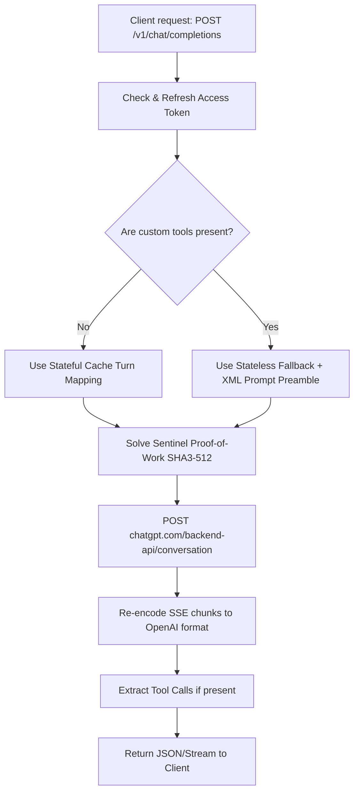

# Unofficial ChatGPT-to-OpenAI API Gateway

[](#)
[](#)
[](#)

A lightweight, zero-dependency Node.js Express server that acts as a local or remote proxy. It allows you to use your web-based ChatGPT account as a standard OpenAI-compatible API endpoint inside any client or library (e.g. IDE extensions like **Cursor/Continue/Kilo Code**, frontends like **LobeChat**, or custom scripts).

The gateway automatically handles session-token auto-refreshing, solves upstream **Sentinel Proof-of-Work (PoW)** challenges locally, and translates stateful conversation threads and client-side tool calling formats.

---

## ✨ Features

- **🔄 Automatic Token Refresh**: Logs into your web account using your long-lived `__Secure-next-auth.session-token` browser cookie and automatically fetches/refreshes the short-lived `accessToken` on the fly.
- **⚡ Sentinel PoW Solver**: Solves ChatGPT Web's SHA3-512-based Sentinel Proof-of-Work challenge locally in `0–5ms` to avoid `403 Forbidden` errors.
- **🧠 Stateful Conversation Mapping**: Translates stateless OpenAI message histories into stateful ChatGPT conversation threads via SHA-256 message fingerprinting.
- **🛠️ Client-Side Tool Calling (Agent Mode)**: Intercepts and parses custom tools requested by agentic clients (like Kilo Code) and forwards them seamlessly.
- **🧩 Multi-Format Tool Extraction**: Uses a 4-pass parser to extract tool calls from model outputs in multiple formats (XML tags, bare fenced JSON, bare function calls, and custom-named XML tags).
- **📡 Server-Sent Events (SSE)**: Converts ChatGPT's accumulated-stream chunks into standard real-time OpenAI chunk deltas.
- **🎨 Premium UI Dashboard**: Served on the root `/` route for interactive prompting, model switching, and real-time latency/model tracking.

---

## 🏗️ How It Works

### 1. Request Lifecycle


### 2. Stateful Conversation Threads
When no custom client tools are present, the proxy automatically maps turn histories to the exact `conversation_id` and `parent_message_id` on the ChatGPT backend. 
- Computes a SHA-256 fingerprint of the message history prefix (roles, names, contents, and tool outputs).
- Hits or misses local thread caches to maintain context natively on ChatGPT's servers without having to re-send collapsed context.

### 3. Agent Tool Call Fallback (Kilo Code)
ChatGPT's backend does not support registering custom, client-side tools (like a local terminal execution tool). When client tools are sent:
1. **Stateless Fallback**: The proxy bypasses stateful mapping and falls back to a stateless conversation turn.
2. **Preamble Injection**: Prepends a strict `<tool_call>` system prompt protocol to the prompt message describing the XML formatting.
3. **Model Upgrade**: Automatically upgrades the request model to `gpt-5-5-thinking` (if a reasoning model is not already requested) to guarantee strong protocol adherence.

### 4. Robust 4-Pass Tool Call Parser
The proxy is highly resilient to model variations and parses tool calls using four sequential passes:
- **Pass 1 (XML Tags)**: Matches generic tags: `<tool_call>`, `<function_call>`, `<call>`, or `<tool>`.
- **Pass 2 (Fenced JSON)**: Parses bare JSON objects inside code fences (e.g. ` ```json ... ``` `) if no XML tags are emitted.
- **Pass 3 (Bare Function Calls)**: Extracts standard function call formatting: `tool_name(json_arguments)`.
- **Pass 4 (Custom XML Tags)**: Matches tags named after the tool itself (e.g. `<file_search.msearch>{"queries":[]}</file_search.msearch>`), ignoring a blacklist of standard HTML tags to avoid false positives.

---

## 🛠️ Step-by-Step Setup Guide

### 1. Extract Your Session Cookie
To let the server call ChatGPT on your behalf, copy your long-lived session cookie:
1. Go to [https://chatgpt.com](https://chatgpt.com) and log in.
2. Press `F12` (or `Cmd + Option + I` on Mac) to open DevTools.
3. Go to the **Application** tab (Chrome/Edge/Safari) or **Storage** tab (Firefox).
4. Expand **Cookies** and select `https://chatgpt.com`.
5. Locate the cookie named **`__Secure-next-auth.session-token`** and copy its **Value** (a very long string).

### 2. Configure Environment Variables
Create a `.env` file in the project directory:
```env
PORT=3000

# Paste your copied session token here:
CHATGPT_SESSION_TOKEN=eyJhbGciOiJkaXIiLCJlbmMiOiJBMjU2R0NNIn0...

# (Optional) Full raw cookie header from chatgpt.com if Sentinel still 401s:
CHATGPT_COOKIES=

# (Optional) Add a local API key to protect your proxy:
PROXY_API_KEY=

# Default model id to send upstream when client omits it
DEFAULT_MODEL=auto

# Auto-upgrade standard models to thinking variants when tools are present (default: false)
TOOL_FORCE_THINKING=false
```

### 3. Start the Server
```bash
# Install dependencies
npm install

# Start the proxy server
npm start
```
By default, the server starts on `http://localhost:3000`. Override the port if needed:
```bash
PORT=3002 npm start
```

---

## 🚀 Client Integration Guide

### 1. Kilo Code (VS Code Extension)
Open your global `~/.config/kilo/kilo.jsonc` file and configure a custom provider:
```jsonc
{
  "provider": {
    "chatgpt-gateway": {
      "name": "ChatGPT Gateway",
      "api": "http://localhost:3000/v1",
      "npm": "@ai-sdk/openai-compatible",
      "options": {
        "apiKey": "anything", // Or your PROXY_API_KEY
        "baseURL": "http://localhost:3000/v1"
      },
      "models": {
        "gpt-5-5-thinking": { "name": "GPT-5.5 Thinking" },
        "gpt-5-5": { "name": "GPT-5.5" }
      }
    }
  },
  "model": "chatgpt-gateway/gpt-5-5-thinking"
}
```

### 2. Cursor IDE
1. Open Cursor **Settings** -> **Models**.
2. Under **OpenAI API**, override the Base URL: `http://localhost:3000/v1`.
3. Set the API Key to `anything` (or your configured `PROXY_API_KEY`).

### 3. Continue (VS Code Extension)
Add the model definition to your `config.json`:
```json
{
  "models": [
    {
      "title": "ChatGPT Local Proxy",
      "provider": "openai",
      "model": "gpt-5-5-thinking",
      "apiBase": "http://localhost:3000/v1",
      "apiKey": "anything"
    }
  ]
}
```

### 4. LobeChat / NextChat
Set the custom OpenAI proxy URL:
- **API Key**: `anything`
- **Base URL**: `http://localhost:3000/v1`

---

## ⚠️ Essential Notices & Disclaimers

> [!WARNING]
> **Account Security**: Keep your `__Secure-next-auth.session-token` secure. Sharing it or checking it into public repositories gives anyone full control of your ChatGPT account!

> [!IMPORTANT]
> **Rate Limits & IP Blocks**: This proxy uses your browser's session, making you subject to the same rate limits and IP checks as the web application. Fast parallel requests may trigger Cloudflare checks or temporary rate-limiting.

> [!CAUTION]
> **Terms of Service**: This is an unofficial tool and violates OpenAI's terms of service regarding automated scrapers. Use it strictly for personal evaluation and experimentation.
